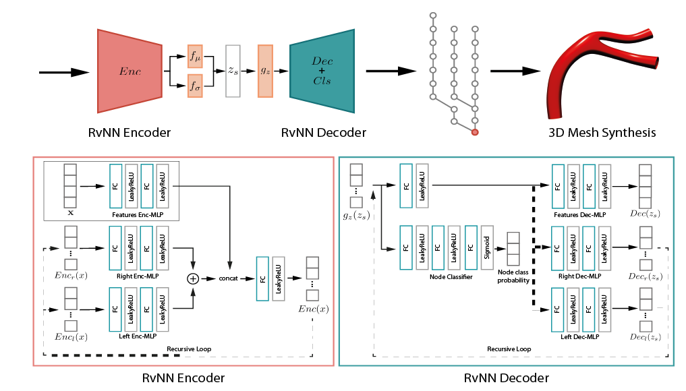

# VesselVAE: Recursive Variational Autoencoders for 3D Blood Vessel Synthesis
We present a data-driven generative framework for synthesizing blood vessel 3D geometry. 
This is a challenging task due to the complexity of vascular systems, which are highly variating in shape, size, and structure.
Existing model-based methods provide some degree of control and variation in the structures produced, but fail to capture the diversity of actual anatomical data.
We developed VesselVAE, a recursive variational Neural Network that fully exploits the hierarchical organization of the vessel and learns a low-dimensional manifold encoding branch connectivity along with geometry features describing the target surface. 
After training, the VesselVAE latent space can be sampled to generate new vessel geometries. 
To the best of our knowledge, this work is the first to utilize this technique for synthesizing blood vessels. 
We achieve similarities of synthetic and real data for radius (.97), length (.95), and tortuosity (.96).
By leveraging the power of deep neural networks, we generate 3D models of blood vessels that are both accurate and diverse, which is crucial for medical and surgical training, hemodynamic simulations, and many other purposes.

[Full Paper](https://arxiv.org/pdf/2307.03592.pdf)
[Demo](https://huggingface.co/spaces/paufeldman/vv)
[Dataset] (https://github.com/intra3d2019/IntrA)

# Code 
For the whole preprocessing pipeline, from mesh to binary tree run sections.ipynb (preprocessing folder)
To train the network, run VesselVAE.ipynb
